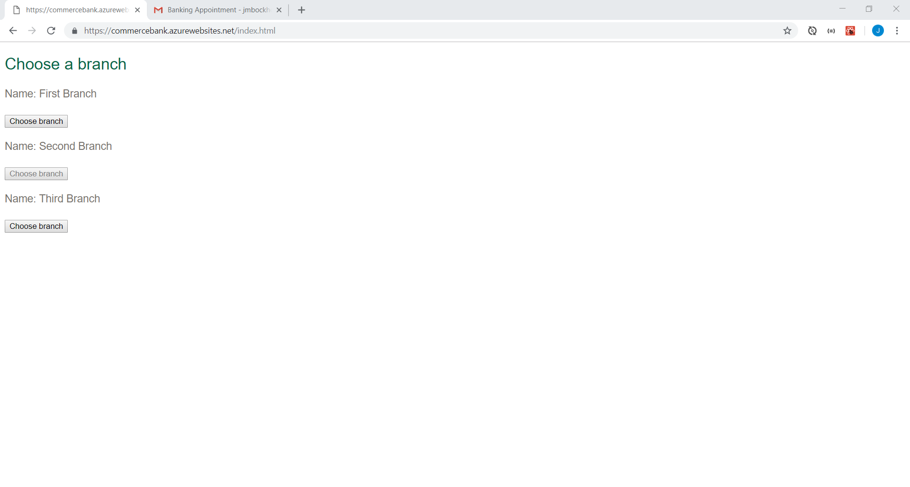
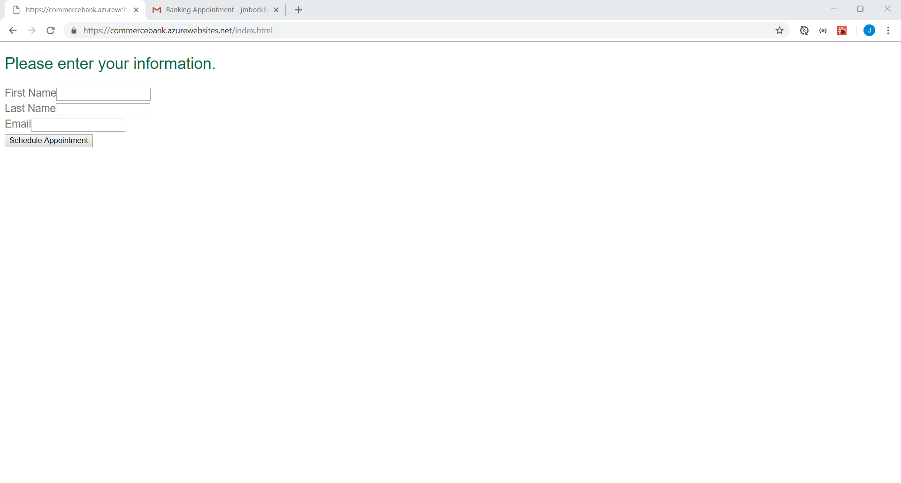
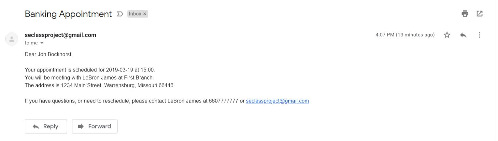
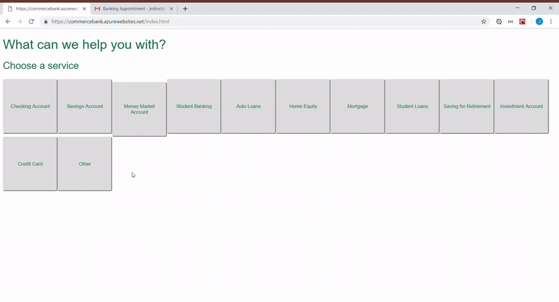

# Release 0.1.0
This is the first released version of the Commerce Bank scheduling application. The web application allows a customer to schedule an appointment at a bank branch for a specific service. 

## General features

### Basic customer flow

The customer follows these basic steps to schedule an appointment. They are broken down into seperate pages. When they schedule an appointment, a confirmation email is sent to the customer. 

  - [Choosing a service](#choosing-a-service)
  - [Choosing a branch](#choosing-a-branch)
  - [Choosing an appointment time](#choosing-an-appointment-time)
  - [Entering customer information](#entering-customer-information)
  - [Viewing the appointment details](#viewing-the-appointment-details)

## Choosing a service

The customer chooses the service that they need an appointment for.

## Choosing a branch

The customer chooses the branch that they want an appointment at. 

## Choosing an appointment time

The customer chooses a time and date for the appointment.

## Entering customer information

The customer enters their name and email address. Then they click the button to schedule the appointment.

## Viewing the appointment details

The customer can view the confirmation that the appointment has been scheduled.

## Email

An email is sent to the customer when they schedule an appointment. 

## Example

Here is an example of the customer moving between pages. There is a loading circle when the application is loading the data.

