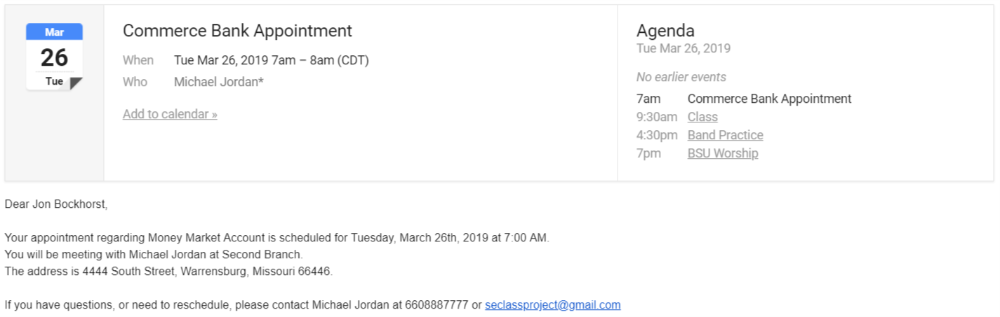
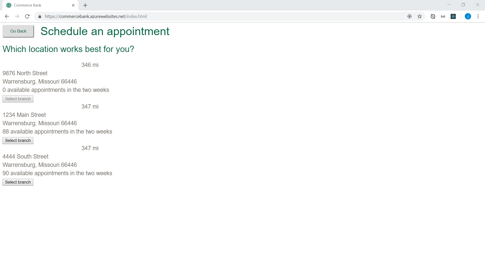

# Release 0.2.0

This is the second release of the Commerce Bank scheduling application. Here are some of the improvement highlights:

- [General improvements - Page transitions, Back button, Speed improvements, Manager assignment](#general-improvements)
- [Email improvements - Emails to managers, Calendar invite attachment, Improved email body text](#email-improvements)
- [Branches improvements - Branch details, Branch distance](#branches-improvements)
- [Appointment times improvements - Appointment times organized by date](#appointment-times-improvements)
- [Customer details improvements - Phone number](#customer-details-improvements)

## General improvements

### Page transitions

A slide transition was added in between the navigation of pages. This also works with the new back button.

### Back button

A new back button allows the customer to go back to the previous step at any time until they schedule the appointment.

### Speed improvements

We fixed a bug that dramatically decreased the loading time of the data when navigating between pages. Specifically, loading the appointment times is much faster.

### Manager assignment

A manager is now assigned to an appointment when it is scheduled. This manager has the needed service skills to help the customer.

## Email improvements

### Emails to managers

Now that a manager is assigned to an appointment, when an email is sent, the manager is CC'd and recieves a copy of the email.

### Calendar invite attachment

Attached to the email is a calendar invite that allows for integration into a calendar service

### Improved email body text

We improved how date and time are sent as well as other minor grammatical improvements.

## Branches improvements

### Branch details

Each branch now shows its address and how many appointments are available in the next two weeks.

### Branch distance

Branches now show the distance in miles from the customer's current location. Location permissions must be enabled in the browser for it to work correctly.

## Appointment times improvements

### Appointment times organized by date

The available appointment times are now organized by date.

## Customer details improvements

### Phone number

The customer can now enter their phone number along with the other information.
