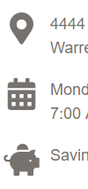
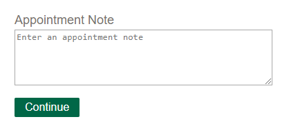
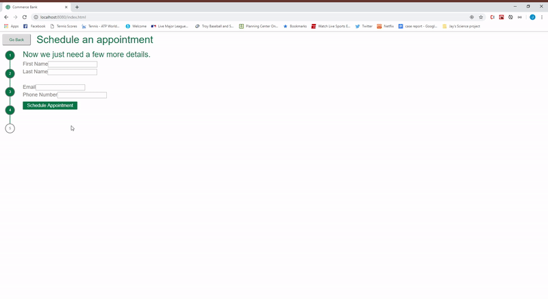
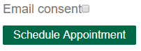

# Release 0.3.0

This is the third release of the Commerce Bank scheduling application. Here are some of the improvement highlights:

- [General improvements - Icons, Progress bar, Improved styling](#general-improvements)
- [Services improvements - Multiple services, Custom note, Improved styling](#services-improvements)
- [Customer info improvements - Input validation, Email consent](#customer-info-improvements)
- [Appointment details improvements - Cancel appointment](#appointment-details-improvements)

## General improvements

### Icons

FontAwesome icons have been added throughout the application to improve the visual design.

### Progress bar

A new progress bar shows the customer which page they are on in the scheduling process.

### Improved styling

Many other styling improvements were made to enhance the design of the application

## Services improvements

### Multiple services

A customer can now choose multiple services for an appointment. A manager will be assigned to the appointment who is skilled in all of those services.

### Custom note

A customer can add a custom note when choosing the service they need help with.

### Improved styling

The services are now arranged in a table that is easier to navigate. 

## Customer info improvements

### Input validation

All input is now validated to ensure that the customer has entered the necessary information. 

### Email consent

There is now a checkbox for email consent. This must be checked if the customer wants to recieve a confirmation email. The default is not checked and no consent. 

## Appointment details improvements

### Cancel appointment

When viewing the details of the appointment, the customer has the option of cancelling the appointment. 

