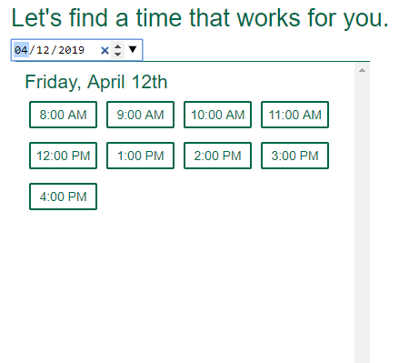
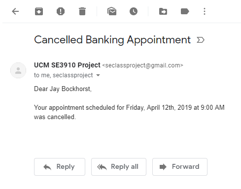
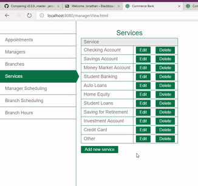
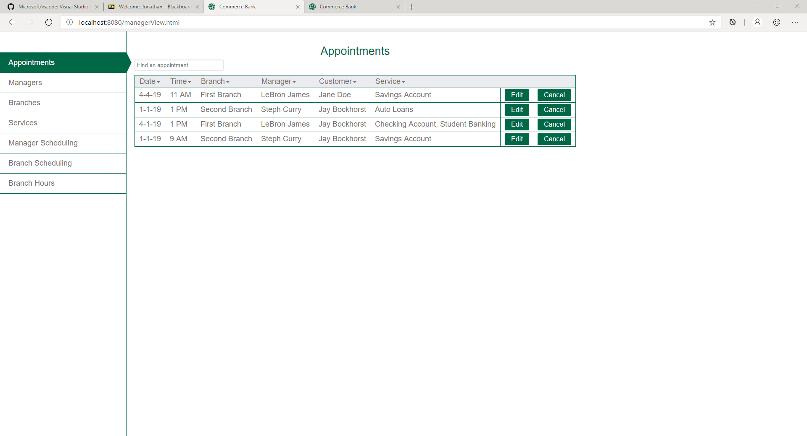
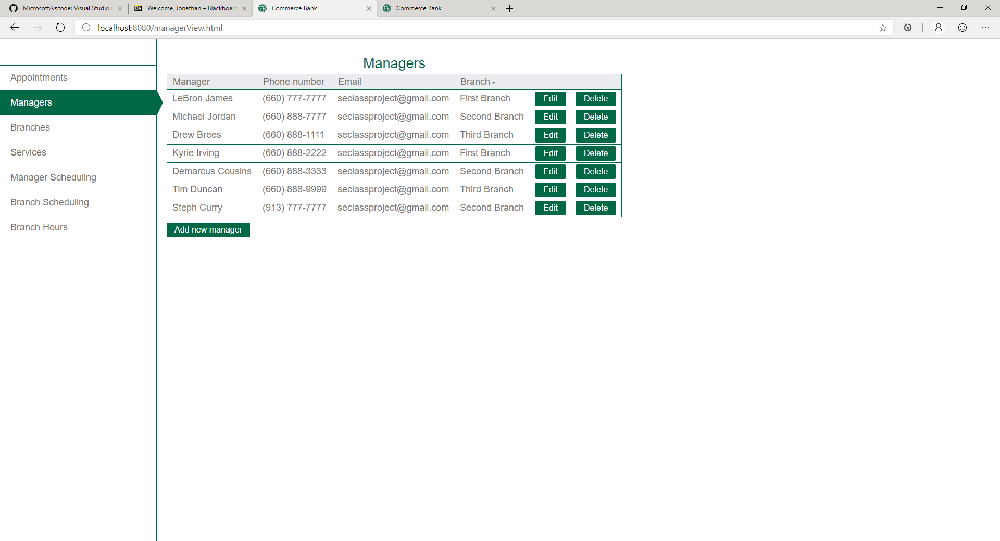
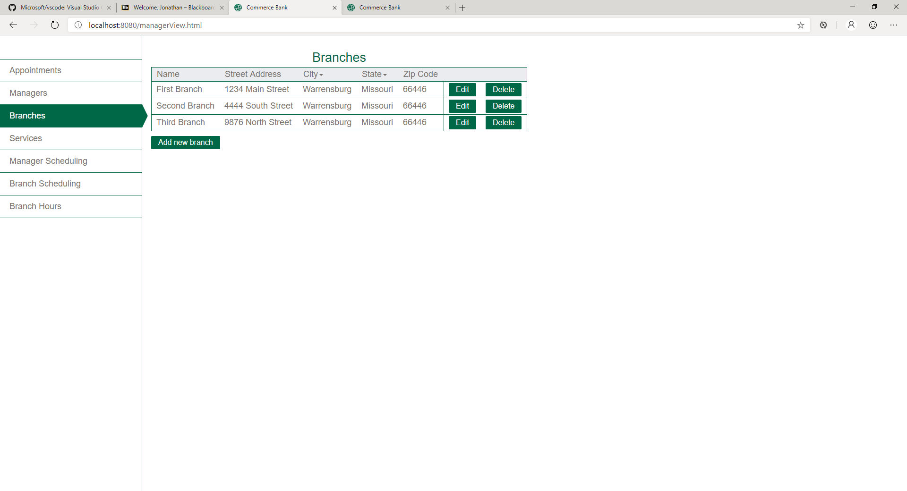
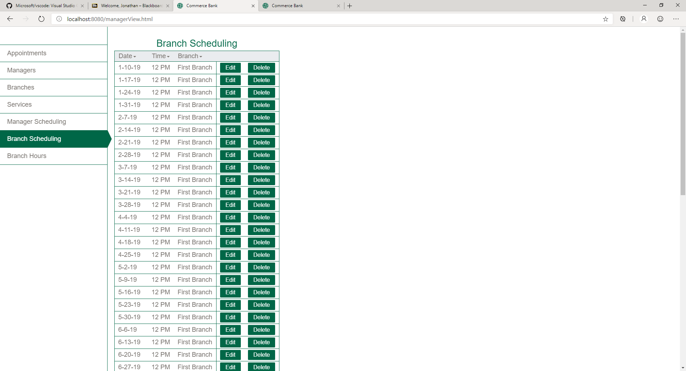

# Release 0.4.0

This is the fourth release of the Commerce Bank scheduling application. Here are some of the improvement highlights:

- [Customer view - Date picker, Same day appointments, Email sent when appointment is cancelled or updated](#customer-improvements)
- [Manager view - Maintain appointments, Maintain managers, Maintain branches, Maintain services, Maintain branch scheduling, Maintain manager scheduling](#customer-improvements)

## Customer view

### Date picker when choosing appointment time

There is now a date picker that the customer can use when choosing an appointment time. This allows them to select any future date.

### Same day appointments

The customer can now choose an appointment time on the same day. 

### Email sent when appointment is canceled or updated
The customer will now recieve an email if their appointment has been cancelled or updated in any way. 

## Manager view

The manager view gives managers the ability to maintain all of the data in the system. All of the information can be viewed, edited, or deleted. Here is an example of the services being maintained.

### Maintain appointments

Managers can view and maintain the appointments. They can filter appointments by any of the data, and they can also edit or cancel an appointment.

### Maintain managers

Managers can also maintain the managers in the system. This includes adding new managers, as well as editing or deleting current ones.

### Maintain branches

Managers can also maintain the branches in the system. This includes adding new branches, as well as editing or deleting current ones.

### Maintain services

Services can be maintained by the manages. This includes adding, editing, and deleting services.

### Maintain branch scheduling

Managers can also maintain branch scheduling. This is for adding unavailable time slots when the branch is not available for appointments.

### Maintain manager scheduling

Managers can also maintain manager scheduling. This is for adding unavailable time slots when the certain manager is not available for appointments. This looks the same as the branch scheduling.